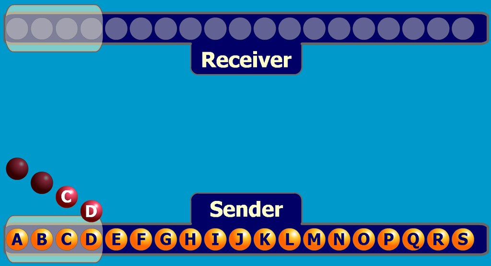
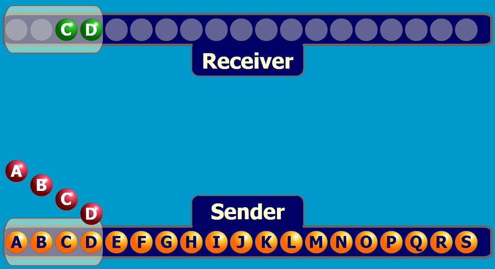
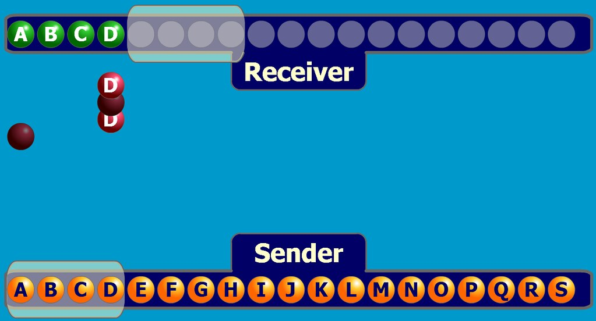
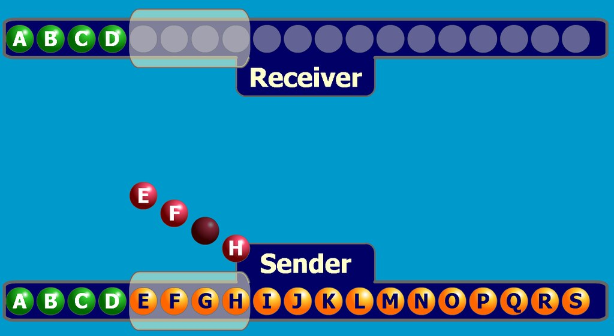
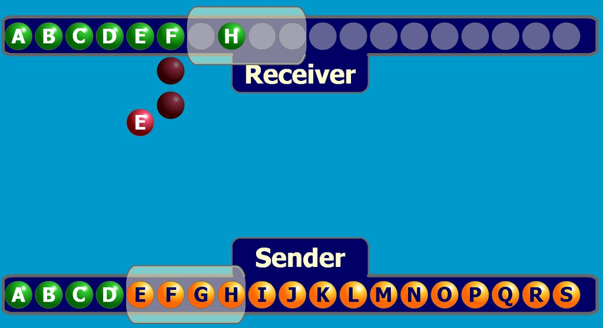
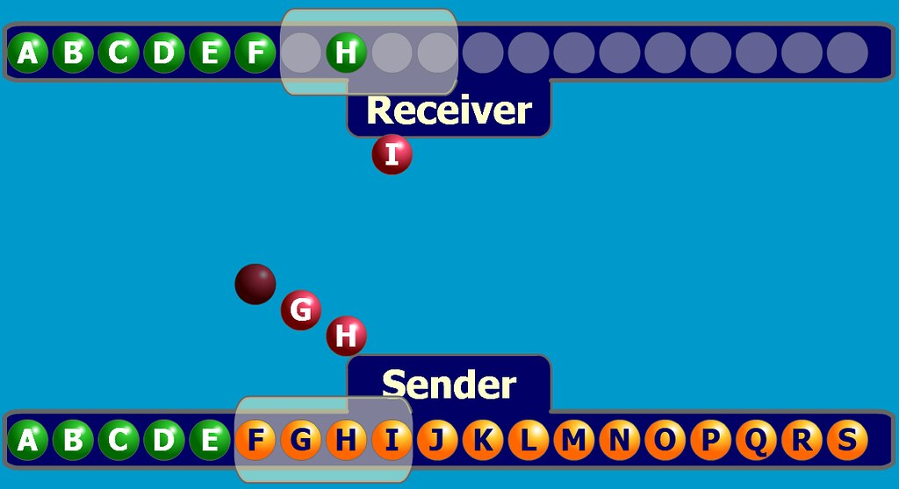
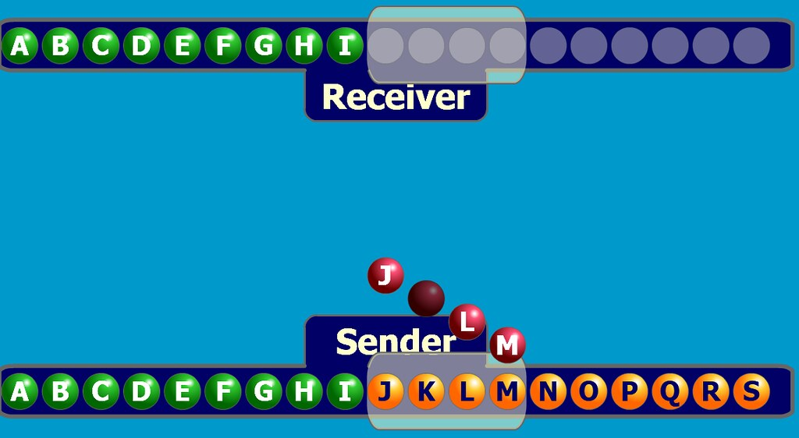

#TCP 滑动窗口

##概述

滑动窗口实现了TCP流控制。首先明确滑动窗口的范畴：TCP是双工的协议，会话的双方都可以同时接收和发送数据。TCP会话的双方都各自维护一个发送窗口和一个接收窗口。各自的接收窗口大小取决于应用、系统、硬件的限制（TCP传输速率不能大于应用的数据处理速率）。各自的发送窗口则要求取决于对端通告的接收窗口，要求相同。

滑动窗口解决的是流量控制的的问题，就是如果接收端和发送端对数据包的处理速度不同，如何让双方达成一致。接收端的缓存传输数据给应用层，但这个过程不一定是即时的，如果发送速度太快，会出现接收端数据overflow，流量控制解决的是这个问题。

##窗口的概念
发送方的发送缓存内的数据都可以被分为4类: 

1. 已发送，已收到ACK 
2. 已发送，未收到ACK 
3. 未发送，但允许发送 
4. 未发送，但不允许发送

其中类型2和3都属于发送窗口。

接收方的缓存数据分为3类： 

1. 已接收 
2. 未接收但准备接收 
3. 未接收而且不准备接收

其中类型2属于接收窗口。

窗口大小代表了设备一次能从对端处理多少数据，之后再传给应用层。缓存传给应用层的数据不能是乱序的，窗口机制保证了这一点。现实中，应用层可能无法立刻从缓存中读取数据。

##滑动机制

1. 发送窗口只有收到发送窗口内字节的ACK确认，才会移动发送窗口的左边界。
2. 接收窗口只有在前面所有的段都确认的情况下才会移动左边界。当在前面还有字节未接收但收到后面字节的情况下，窗口不会移动，并不对后续字节确认。以此确保对端会对这些数据重传。
3. 遵循快速重传、累计确认、选择确认等规则。
4. 发送方发的window size = 8192;就是接收端最多发送8192字节，这个8192一般就是发送方接收缓存的大小。

##分析滑动窗口机制
1. 首先发送端发送A,B,C,D四个包，但是A,B丢失，只有C,D到达接收端。 

2. 接收端没有收到A，所以不回复ACK包。发送端重传A,B,C,D四个包，这次全都到达了。

3. 接收端先获得A，发ACK包A，但是中途丢失；获得B后，根据累计确认的原则，发D的ACK包，然后窗口滑动。再次获得C,D后，连续回复2个D的ACK包，其中C对应的ACK包丢失。 

4. 发送端连收2个D的ACK包，说明4个包对方都已收到，窗口滑动，发E,F,G,H包，其中G包丢失。现在整个序列的状态：ABCD是已发送已确认，EFGH是已发送未确认，I~S是不能发送。 

5.接收端先收到E，发ACK包；收到F后发F的ACK包；未收到G，还是发F的ACK包；收到H，还是发F的ACK包。不幸的是，三个ACK包全都丢失。

6.发送端收到E的ACK包，窗口向右滑动一位；然后再发送F,G,H,I，其中F丢失。

7.接收端获得I，因为没有G，只好回复F的ACK包。相继收到G,H包。

8.接收端根据累计确认，连发两个I包，其中H对应的丢失。窗口向右滑动。

9.发送端接收I的ACK包后，向右滑动四位。发送J,K,L,M四个包，后面不再分析。 

##滑动窗口结论
1. 发送方没有收到接收方发回的ACK，就不能向右滑动。假设发送方向接收方发了ABCD就滑动，只要对方没收到A，就不能滑动，那么就会出现二者不同步的局面。
2. 滑动窗口提高了信道利用率，TCP是发送报文段为单位的，假如每发一个报文就要等ACK，那么对于大数据包，等待时间就太长了。只要发送的报文在滑动窗口里面，不用等每个ACK回来就可以向右滑动。本例中，开始接收端空着AB，只有CD，此时不能滑动；之后接收到EF和H，直接向右滑动2位，不必等G到位
3. 窗口大小不能大于序号空间大小的一半。目的是为了不让两个窗口出现交迭，比如总大小为7，窗口大小都为4，接收窗口应当滑动4，但只剩3个序号，导致两个窗口交迭
4. 有一种情况没出现：发送方发ABCD，接收方都收到然后向右滑动，但回复的ACK包全丢了。发送方未收到任何ACK， timeout后会重发ABCD，此时的接收方按累计确认的原则，收到ABCD后只会重发D的ACK，发送方收到后向右滑动

##对比滑动窗口和拥堵窗口
滑动窗口是控制接收以及同步数据范围的，通知发送端目前接收的数据范围，用于流量控制，接收端使用。拥塞窗口是控制发送速率的，避免发的过多，发送端使用。因为tcp是全双工，所以两边都有滑动窗口。 
两个窗口的维护是独立的，滑动窗口主要由接收方反馈缓存情况来维护，拥塞窗口主要由发送方的拥塞控制算法检测出的网络拥塞程度来决定的。

拥塞窗口控制sender向connection传输数据的速率，使这个速率为网络拥堵状况的函数。

